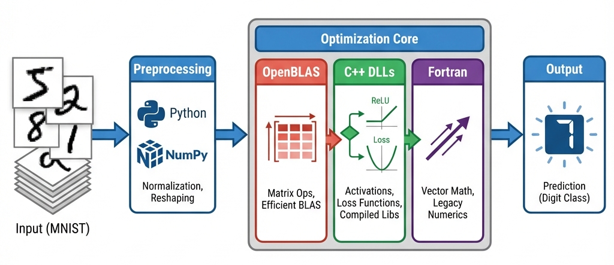

# Digit Recognition CNN from Scratch

<p align="center">
  
  
  
</p>

A handwritten digit recognition system built from scratch using Python. This project demonstrates high-performance optimization by integrating C extensions, Fortran, and OpenBLAS with a custom Python CNN implementation.

<p align="center">
  
</p>

[Notebook](./lab.pynb)

## 🎯 Key Features

- **From-scratch implementation** using NumPy and SciPy.
- **Performance optimizations**:
  - C extensions for core functions (Softmax, ReLU, Loss, Weight/Bias updates).
  - Fortran `f2py` extension for vector operations.
  - OpenBLAS integration for accelerated matrix multiplication.
- **Custom compiled modules** loaded via `ctypes`.
- **Complete training pipeline** included in `lab.ipynb`.

## 🚀 Getting Started

### Prerequisites

- Python 3.8+
- NumPy
- SciPy
- Jupyter Notebook

### Installation

1. **Clone the repository:**
   ```bash
   git clone https://github.com/77AXEL/Digit-Recognizer
   cd Digit-Recognizer
   ```

2. **Extract the dataset:**
   ```bash
   unzip data.zip
   ```
   > **Note:** This step is required before training.

3. **Install dependencies:**
   ```bash
   pip install numpy scipy jupyter
   ```

4. **(Optional) Rebuild binaries:**
   If you need to recompile for your specific environment:
   ```bash
   cd lib
   make
   ```
   *Requires `gfortran` and `g++` (MinGW on Windows).*

### Usage

Open and run the main notebook to train and test the model:

```bash
jupyter notebook lab.ipynb
```

## 🔧 Technical Details

<p align="center">
  
</p>

This project explores low-level neural network optimization. Instead of relying on frameworks like PyTorch or TensorFlow, it implements the forward and backward passes manually.

- **Architecture:** Standard CNN with alternating Convolutional/Pooling layers and Fully Connected layers.
- **Optimization:** Computationally intensive tasks (loops, dense math) are offloaded to compiled C/Fortran code to remove Python interpreter bottlenecks.

## 📝 License

This project is licensed under the [MIT License](./LICENSE).
