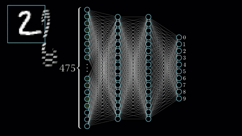
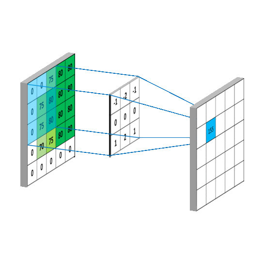
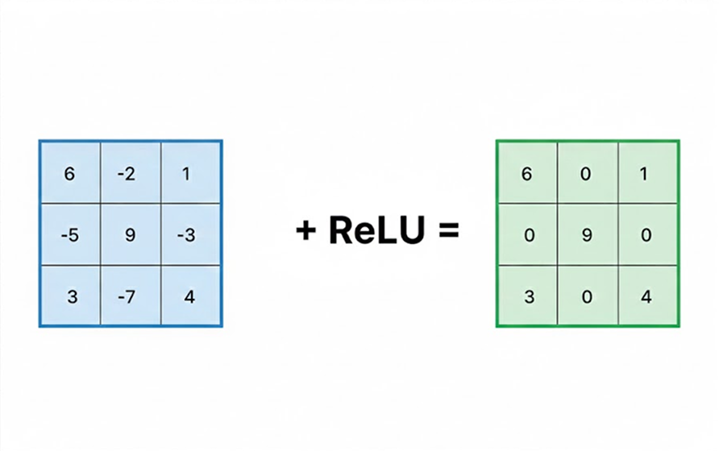
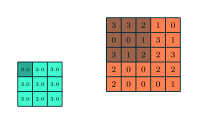
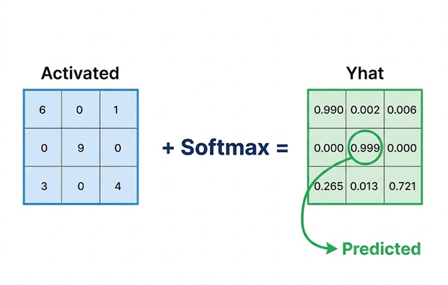
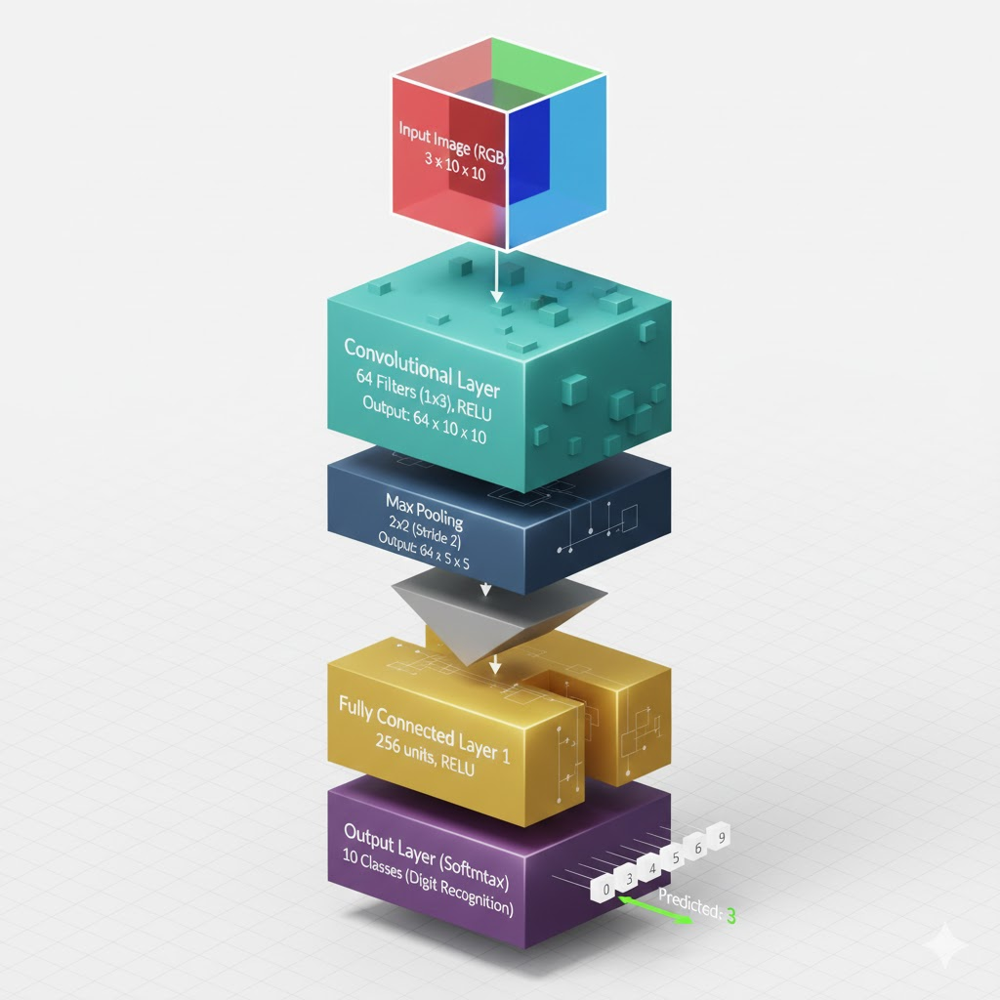

# Digit Recognition CNN from Scratch

A handwritten digit recognition system built from scratch using Python, with performance-optimized implementations using C extensions, Fortran, OpenBLAS and custom DLLs.
<p align="center">
  
  
  
  
</p>

- [Project Notebook](./lab.ipynb)

## 💡 Learning the CNN Fundamentals

This section provides visual examples of the fundamental operations within the Convolutional Neural Network architecture used in this project. Understanding these low-level processes is key to appreciating the performance optimizations explored here.

### Convolutional Layer: Feature Extraction

The **Convolutional Layer** applies a set of **filters** (kernels) to the input image. Each filter scans the image, performing a dot product between the filter weights and the small portion of the image it's currently over, generating a single feature map. This process allows the network to automatically learn hierarchical features, such as edges, textures, and ultimately, parts of a digit.
<p align="center">
  
</p>

---

### ReLU Activation: Introducing Non-Linearity

The **Rectified Linear Unit (ReLU)** is a non-linear activation function applied element-wise to the output of the convolutional layer and the dot product. It simply converts all negative input values to zero while keeping positive values unchanged.
<p align="center">
  
</p>

$$
\text{ReLU}(x) = \max(0, x)
$$

This non-linearity is crucial because it allows the network to learn more complex patterns than would be possible with only linear transformations.

---

### Max Pooling: Downsampling and Invariance

**Max Pooling** is a downsampling operation that reduces the spatial dimensions (height and width) of the feature maps. It slides a filter (e.g., $2 \times 2$) over the feature map and only keeps the maximum value within that region.
<p align="center">
  
</p>

$$
\text{Output}(i, j) = \max_{x, y \in \text{Region}(i, j)} \text{Input}(x, y)
$$

This operation has two main benefits:
1.  **Reduces the number of parameters** and computation, which helps prevent overfitting.
2.  Provides **translational invariance**, meaning the network can still recognize a digit even if its position shifts slightly in the input image.

---

### Softmax Layer: Probability Distribution

The final layer in the network is the **Softmax Layer**. It takes the output of the final fully-connected layer (the logits) and converts them into a probability distribution over the $K$ classes (where $K=10$ for the digits 0-9). The output is a vector where each element represents the probability that the input image belongs to a specific class. The sum of all probabilities is $1$.
<p align="center">
  
</p>

$$
\sigma(\mathbf{z})_i = \frac{e^{z_i}}{\sum_{j=1}^{K} e^{z_j}} \quad \text{for } i = 1, \dots, K
$$

The index with the highest probability is the predicted digit.

---
### Optimization and Performance

* **OpenBLAS**: Utilized for high-performance matrix multiplication, which is critical for the compute-intensive dense layers.
* **Optimized C++ DLLs**: Core operations such as ReLU, Softmax, loss computation, weights/biases updates, and L2 regularization are implemented in C++ and exposed to Python via DLLs.
* **Fortran C Extension**: Vector addition, a frequent and computation-heavy operation, is implemented in Fortran and integrated into Python through a C extension.

> This approach effectively removes Python bottlenecks by offloading intensive numerical computations and loop-heavy logic to compiled code.

---

### CNN Architecture Overview

The specific **architecture** for the digit recognition task typically follows a pattern of alternating Convolutional and Pooling layers, followed by one or more Fully Connected layers at the end. This diagram illustrates the general flow from the input image to the final classification.
<p align="center">
  
</p>

The architecture used in this project is implemented from scratch, demonstrating the custom logic for each of these stages in both the forward and backward (training) passes.

---

## 📋 Overview

This is a **learning and experimentation project** that implements a Convolutional Neural Network (CNN) for digit recognition without relying on high-level deep learning frameworks. The project explores low-level optimization techniques and demonstrates how to integrate compiled code with Python for better performance.

## 🎯 Key Features

- **From-scratch implementation** using NumPy and SciPy
- **Performance optimizations** through multiple approaches:
  - C extensions for core functions (softmax, ReLU, loss calculation, weight/bias updates)
  - Fortran f2py extension for vector addition operations
  - OpenBLAS integration for accelerated tensor dot products
- **Custom compiled modules** loaded via ctypes
- **Complete training pipeline** for digit classification

## 🚀 Getting Started

### Prerequisites

- Python 3.8+
- NumPy
- SciPy
- Jupyter Notebook (for running lab.ipynb)

### Installation

1. Clone the repository:

```bash
git clone https://github.com/77AXEL/Digit-Recognizer
cd Digit-Recognizer
```

2. **Extract the dataset (mnist)**:

```bash
unzip data.zip
```

> - This step is required before training the model.

3. Install Python dependencies:

```bash
pip install numpy scipy jupyter
```

4. Optional **(for max performance or Python compatibility issues):**

```bash
cd lib
make
```

> - Rebuilds `funcs.dll` and `module.cp38-X.pyd` for your CPU, improving speed and avoiding issues if your Python isn’t version 3.8.
> - **Note:** Requires `gfortran` and `g++` compilers. On Windows, you can install [MinGW](https://www.mingw-w64.org/downloads/#mingw-w64-builds) and use `mingw32-make`.

### Running the Project

Open and run the main notebook:
```bash
jupyter notebook lab.ipynb
```

The notebook contains the complete pipeline for training and testing the digit recognition CNN.

## 🔧 Technical Details

### Performance Optimizations

1. **OpenBLAS Integration**: Replaces NumPy's default BLAS for faster tensor dot products
2. **C Extensions**: Critical functions implemented in C and loaded via ctypes:
   - Softmax activation
   - ReLU activation
   - Loss computation
   - Weight and bias updates
3. **Fortran Extensions**: Vector addition optimized with f2py (`module.sum_vectors`)

### Architecture

The project uses a convolutional neural network architecture implemented from scratch with custom forward and backward propagation logic.

## 📊 Dataset

The training dataset is provided in `data.zip` and must be **extracted** before use. The dataset contains **mnist** handwritten digit images for training and validation.

## 🎓 Learning Objectives

This project demonstrates:
- Low-level neural network implementation
- Performance optimization techniques
- Understanding of CNN fundamentals without frameworks

## 📝 License

See the [LICENSE](./LICENSE) file for details.

## ⚠️ Note

This is an educational project focused on understanding the internals of neural networks and optimization techniques. For production use, consider established frameworks like TensorFlow or PyTorch.

---

**Built with curiosity and compiled with care** 🧠✨
